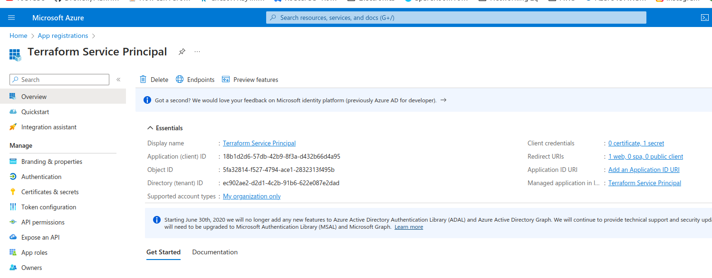
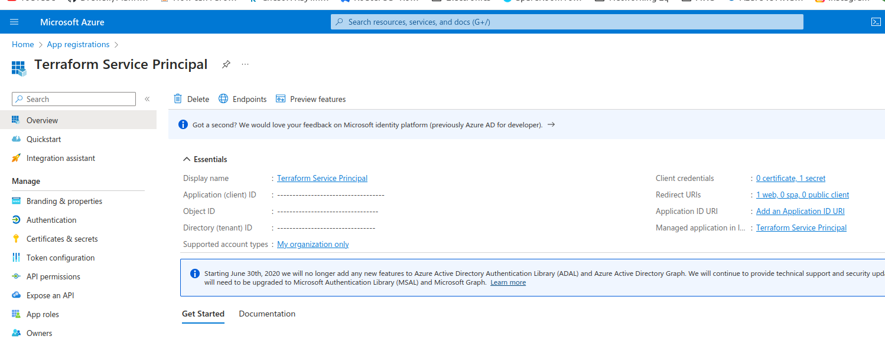
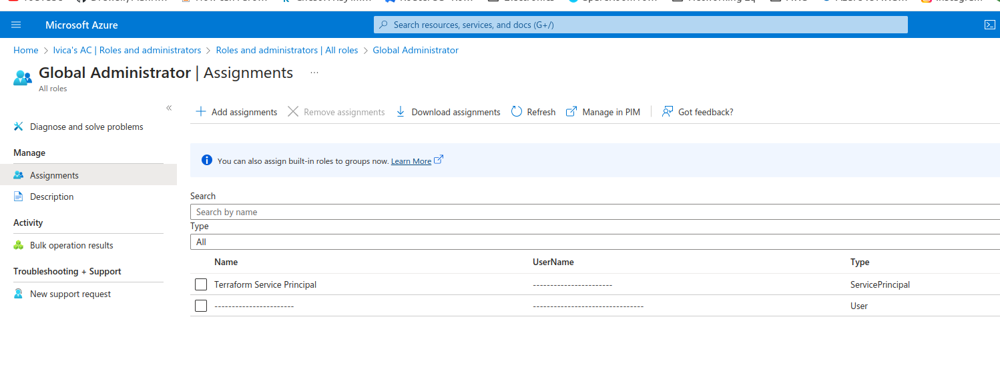
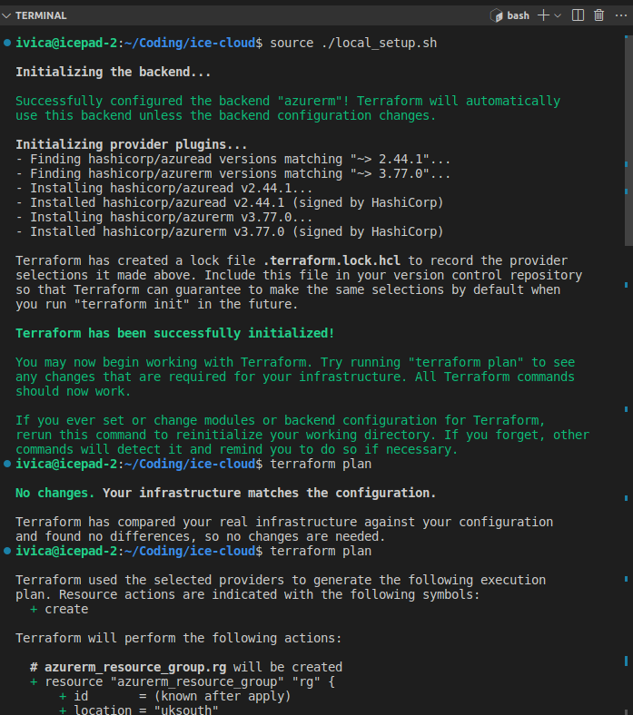

# azure-terraform-template
This repo is a simple template project used to initialize a new Terraform project for interfacing with the Azure cloud.

Minimal setup includes storing a remote state in the Azure cloud, and using a service principal to authenticate with Azure. Service principal has appropriate access to the subscription and the Active Directory tenant.

In addition to the above, this template also includes a github actions flow which will automatically run a `terraform plan` command on every pull request. This allows for a quick sanity check on the changes being made before they are merged into the main branch. The plan output is stored as an artifact on the pull request, and can be downloaded for further inspection. Once the pull request is merged, another github actions flow will run a `terraform apply` command to apply the changes to the infrastructure. Just like for the plan, the apply output is stored as an artifact and in case of failure, github issue is opened with the apply output attached.

## Prerequisites
- Azure subscription
- Azure Service Principal with appropriate access to the subscription and the Active Directory tenant
- Azure storage account for storing the remote state

## Service Principal Setup

1. Create a service principal in the Azure Dashboard and create a client secret for it. Make sure to save the secret as it will not be shown again.


2. Assign the service principal to the subscription


3. Assign the service principal to the Active Directory tenant


## Local development
It is possible to run terraform actions locally from your machine without pushing to github and/or making pull requests. This is useful for testing and debugging. To do so, you need to have terraform installed on your machine. 

Once that is done, you need to set some environment variables. The easiest way to do this is to create a `.env` file in the root of the project and set the variables there. The `.env` file is ignored by git, so it will not be pushed to github. The `.env` file should look something like this:
```
TF_VAR_SUBSCRIPTION_ID=---------------
TF_VAR_TENANT_ID=---------------
TF_VAR_CLIENT_ID=------------------
TF_VAR_CLIENT_SECRET=---------------------------
TF_VAR_STATE_RESOURCE_GROUP_NAME=terraform-states
TF_VAR_STATE_STORAGE_ACCOUNT_NAME=icecloudtfstates
TF_VAR_STATE_CONTAINER_NAME=terraform-state-icecloud-prod
TF_VAR_ENVIRONMENT=prod
```

This now allows you to run terraform commands locally.

